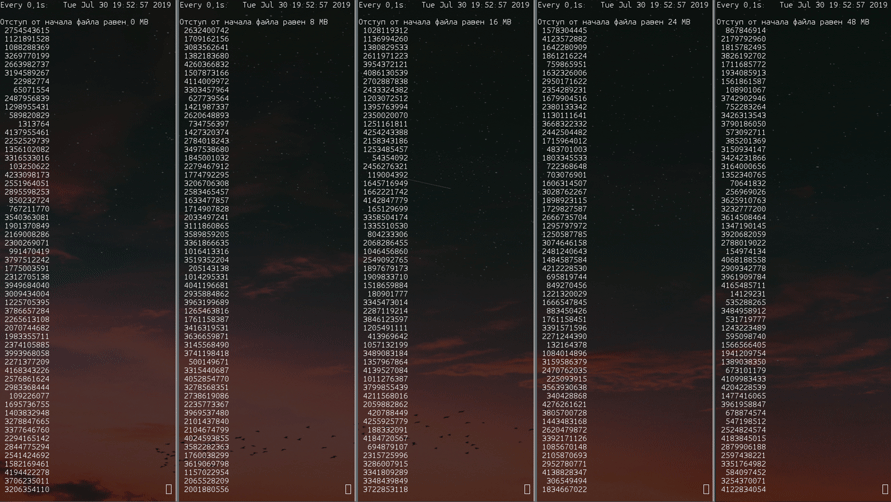
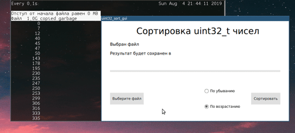
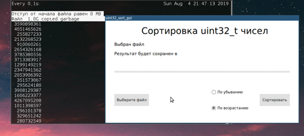
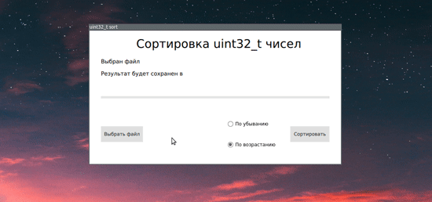

# uint32-sort
## Задание
Дан файл случайного размера, наполненный беззнаковыми, 32-бит числами (`uint32_t`). Нужно:
1. Написать программу для его сортировки ✓
1. Сделать обработку всевозможных ошибок ✓
1. Добавить GUI с помощью Qt5 ✓
1. Уведомлять о прогрессе сортировки (индикатор выполнения) ✓
1. Максимально распараллелить выполнение программы ✓
1. Собирать проект с помощью CMake ✓
1. Выложить проект на github ✓

## Структура проекта
На данный момент заведено 3 ветки:

|   Имя ветки   |                         Предназначение                                             |
|:-------------:| ---------------------------------------------------------------------------------- |
|     aux       | Вспомогательная ветка, содержит полезные скрипты                                   |
|   dev_base    | Ветка, в которой велась разработка ядра программы                                  |
|    dev_qt     | Ветка, в которой ведется разработка GUI и связывание его с ядром программы         |
|    release    | Ветка, в которой находятся исходные файлы готовой к использованию версии программы |
|    master     | Титульная страница                                                                 |


Текущее содержание `dev_base`

```
uint32-sort/
├── include
│   ├── file_manager.hpp
│   └── sort_container.hpp
└── src
    ├── CMakeLists.txt
    ├── file_manager.cpp
    └── sort_container.cpp
```

Текущее содержание `dev_qt` и `release`

```
uint32-sort/
├── build.sh
├── include
│   ├── file_manager.hpp
│   ├── lib_controller.hpp
│   └── sort_container.hpp
├── resources
│   ├── main.qml
│   └── qml.qrc
└── src
    ├── CMakeLists.txt
    ├── lib_controller.cpp
    ├── main.cpp
    └── sort_lib
        ├── CMakeLists.txt
        ├── file_manager.cpp
        └── sort_container.cpp
```

## Текущий результат
Для сортировки использовалась функция `qsort` из `cstdlib`.
На картинке ниже показан процесс работы программы над файлом размером 64 MB



> P.S Данные изображение является не точным отображением скорости работы, а лишь демонстрируют принцип. 
> Точно отобразить изменения не позволяют задержки, связанные с обновлением `watch`, выполнением команды `od` и 
> непосредственной интерпретации Bash'ем инструкций

### GUI и демонстрация порядка сортировки. 
> В следующих gif'ках используется устаревшая версия программы.
> В целом работа осталось той же, только теперь добавились уведомления о завершении сортировки и
> вместо выбора пользователем файла для сохранения, теперь выбирается каталог

Обработка файла в 1GB занимает около 35 секунд на процессоре Intel Core i5-8250U




Так же выполнено требование по обработке ошибок. 
При любой исключительной ситуации выводится специальное окно с информацией о случившемся.

Например:



## Как получить то, что на картинках
1. Скачать репозиторий
1. Перейти в ветку release
1. Запустить скрипт `build.sh`
1. Запустить `uint32_sort_gui`

## Что использовалось при разработке помимо инструментов задания
+ Vim как редактор кода
+ GDB для отладки программы
+ Bash для автоматизации рутинных и одномоментных действий
+ Qt Creator только в качестве редактора интерфейса
